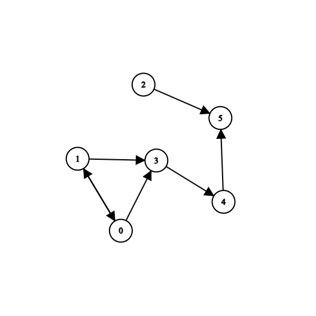

# Problem
You have n number of locked boxes in front of you except the first one that is unlocked. Each box is numbered sequentially from 0 to n - 1 and each box may contain keys to the other boxes. You can only open a box with a key from a box you have unlocked or is already unlocked.

Write a method `canUnlockAll(boxes)` that determines if all the boxes can be opened.

- boxes is a list of lists
- A key with the same number as a box opens that box
- You can assume all keys will be positive integers
- There can be keys that do not have boxes
- The first box boxes[0] is unlocked
- Return True if all boxes can be opened, else return False

# Approach

* **Data Representation**: We can use a directed graph to represent the keys and boxes. 
  - Each node represents a box.
  - An edge leaving a node A into another node B represents node A containing the key that opens node B.
  - The function takes in a list of lists which is convenient cause we can assume it's an [adjacency list](https://www.programiz.com/dsa/graph-adjacency-list).
* **Observation**: In graphs where all boxes can be unlocked, a path from the 0th node(root node) to the (n-1)th node always exists. But, In graphs where not all boxes can be unlocked, there exists at least one node X where no path from the root node to X can be found. 
  ## Case 1(all boxes can be unlocked)
    - Adjacency List: `[[1], [2], [3], [4], []]`
    - ### Graph:
      
  
  ## Case 2(not all boxes can be unlocked)
    - Adjacency List: `[[1, 3], [3, 0], [5], [4], [5], []]`
    - ### Graph:
      
# Solution: 
  - By executing a [Depth first search](https://en.wikipedia.org/wiki/Depth-first_search) from the root node to explore all possible paths while keeping track of all visited nodes, in the end we will have a set of all boxes that can be reached from the root node.
  - After that, we can simply check if all the indexes of all the boxes in our adjacency list are in our set of visited nodes.
  - If any of our indexes from the adjacency list are not present, we can return `False`. Otherwise, return `True`;
